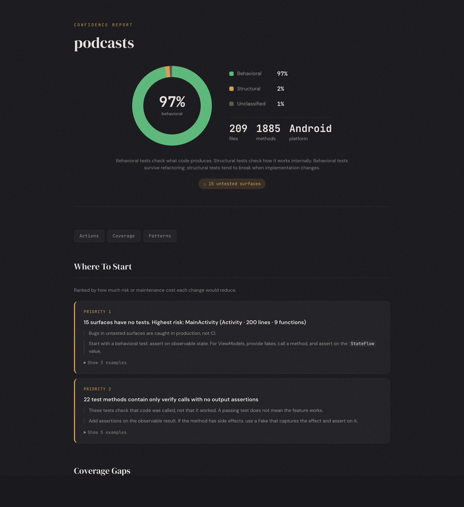

# test-confidence

A CLI tool that analyzes Android & iOS test suite quality through static analysis and git history.

It answers one question: **Do these tests protect this code from breakage, without punishing refactoring?**

<p align="center">
  
  
  
</p>

<p align="center">
  
</p>

## Why

I'm tired of brittle tests that break whenever you touch code. You want to make an architectural change, and you have to refactor your tests first, so they become instantly useless. They can't prove you didn't break anything.

People say "just write better tests" or "just refactor your architecture." But in a legacy codebase where the organisation expects quality and no regressions, you can't safely refactor without tests that support it. You're stuck. And "more tests" isn't the answer when the existing tests are already a tax on every change.

Coverage targets ("get to 60%") don't help either. They tell you nothing about whether the tests you have are actually useful.

This tool takes a different approach. Instead of measuring *quantity*, it measures *quality*: which tests check what code produces (behavioral) vs which tests check how it works internally (structural). It combines that with git history to find where tests are actually costing you maintenance, and where untested code carries the most risk. Everything is evidence-based, traceable to specific files and lines, with cost framing rather than prescriptions.

A lot of the thinking comes from Feathers' [Working Effectively with Legacy Code](https://www.oreilly.com/library/view/working-effectively-with/0131177052/): the idea that you need characterisation tests before you can safely refactor, and the biggest barrier to improving code is not having tests that support change. The git history analysis is inspired by Tornhill's [Your Code as a Crime Scene](https://pragprog.com/titles/atcrime/your-code-as-a-crime-scene/). The behavioral vs structural distinction builds on the [Testing Trophy](https://kentcdodds.com/blog/the-testing-trophy-and-testing-classifications) and Beck's [Test Desiderata](https://testdesiderata.com/), particularly the tension between catching real bugs and not breaking on safe refactors.

## What it does

Confidence reads your source files and git history (it never compiles or runs tests) and tells you:

- Which tests check **what code produces** vs which tests check **how code works internally**
- Which production files have **no tests**, ranked by how complex they are and how often they change
- Which tests **break every time you refactor**, based on actual git co-change history
- Which test files are the **most expensive to maintain**, and why
- Common problems like sleep calls, empty tests, and mock configurations that hide bugs
- Optionally integrates with coverage reports (Kover, JaCoCo, xccov) for a more complete picture

Supports Kotlin/Android (MockK, Mockito, Compose UI tests, Robolectric, JUnit 4/5, Turbine) and Swift/iOS (XCTest, Swift Testing, Quick/Nimble, Mockable, Cuckoo, SnapshotTesting).

## Install

```bash
# From source
go install github.com/timusus/test-confidence/cmd/confidence@latest

# Or build locally
git clone https://github.com/timusus/test-confidence.git
cd test-confidence
go build -o confidence ./cmd/confidence
cp confidence /usr/local/bin/
```

## Usage

```bash
# HTML report (recommended)
confidence scan <path> --html > report.html && open report.html

# With historical trends
confidence scan <path> --html --trend-months 12 > report.html

# Terminal report
confidence scan <path>

# iOS projects
confidence scan <path> --platform ios

# With coverage data (optional, Kover/JaCoCo XML or xccov JSON)
confidence scan <path> --coverage build/reports/kover/report.xml

# JSON output
confidence scan <path> --json

# Compare to a baseline
confidence scan <path> --since 3months
confidence scan <path> --compare-ref v1.0
```

## Design Philosophy

**Signals, not opinions.** The tool surfaces evidence and lets you decide what to do. It doesn't tell you your tests are "good" or "bad." It shows you where they sit on the spectrum between checking outcomes (behavioral) and checking implementation (structural).

**Evidence over assertion.** Every finding points to specific files and lines. If you can't trace a number back to the source, it shouldn't be in the report.

**Cost framing, not prescriptions.** "These 12 test files change every time you refactor, creating friction against improving code" tells you the impact. "You should use fakes instead of mocks" tells you what to do. The tool does the first, not the second.

**Tiered confidence.** Not all signals are equally reliable. The tool is transparent about detection accuracy and never presents a weak signal with the same weight as a strong one.

## Configuration

Create a `.confidence.yaml` in your project root to customize mock placement classification:

```yaml
boundary_types:
  - "*Repository"
  - "*Api"
  - "*DataSource"

internal_types:
  - "*UseCase"
  - "*Interactor"
  - "*Manager"
```

## Claude Code Skill

A [Claude Code](https://github.com/anthropics/claude-code) skill is included. When working in this repo, Claude automatically discovers the skill. To install it globally:

```bash
./install-skill.sh
```

Then ask Claude: "run confidence on this project" or "how are the tests?"

## License

MIT
